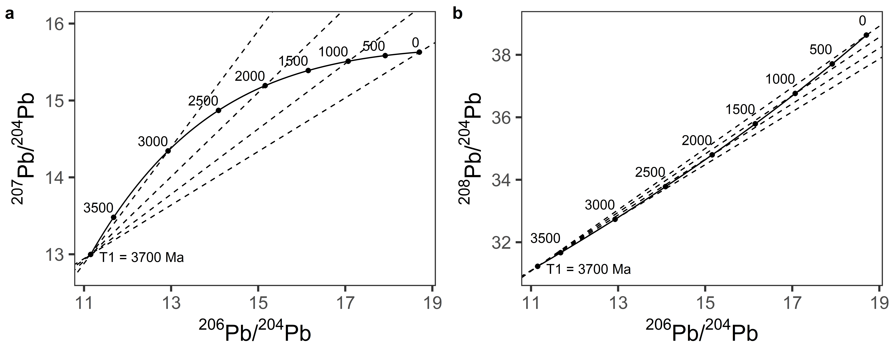

<!-- README.md is generated from README.Rmd. Please edit that file -->

# PbIso

<!-- badges: start -->
<!-- badges: end -->

The goal of PbIso is to …

## Installation

You can install the released version of PbIso from
[CRAN](https://CRAN.R-project.org) with:

``` r
install.packages("PbIso")
```

And the development version from [GitHub](https://github.com/) with:

``` r
# install.packages("devtools")
devtools::install_github("shereearmistead/PbIso")
library(PbIso)
```

# Calculations

All of the functions in `PbIso` take one or more of the basic input
parameters t (time (Ma)), x (<sup>206</sup>Pb/<sup>204</sup>Pb), y
(<sup>207</sup>Pb/<sup>204</sup>Pb) and z
(<sup>208</sup>Pb/<sup>204</sup>Pb) to perform the calculations. For
advanced usage, the functions can also optionally take the values for
different model parameters given in Table 1. See documentation for
details on what input parameters are required or allowed in each
function. The calculations and functions used in `PbIso` assume a
starting composition and model following Stacey and Kramers (1975) 2nd
stage model. These values can be overridden in R if an alternative model
(e.g. Stacey and Kramers (1975) 1st stage or others) is preferred.

| Parameter | Description                                                  | Default.value               | Reference                    |
|:----------|:-------------------------------------------------------------|:----------------------------|:-----------------------------|
| T1        | Model start time (Ma)                                        | 3700                        | Stacey and Kramers (1975)    |
| X1        | <sup>206</sup>Pb/<sup>204</sup>Pb model starting composition | 11.152                      | Stacey and Kramers (1975)    |
| Y1        | <sup>207</sup>Pb/<sup>204</sup>Pb model starting composition | 12.998                      | Stacey and Kramers (1975)    |
| Z1        | <sup>208</sup>Pb/<sup>204</sup>Pb model starting composition | 31.23                       | Stacey and Kramers (1975)    |
| Mu1       | <sup>238</sup>U/<sup>204</sup>Pb model (*μ*<sub>1</sub>)     | 9.74                        | Stacey and Kramers (1975)    |
| Ka1       | <sup>232</sup>Th/<sup>238</sup>U model (*κ*<sub>1</sub>)     | 3.78                        | Stacey and Kramers (1975)    |
| W1        | <sup>232</sup>Th/<sup>204</sup>Pb model (*ω*<sub>1</sub>)    | 36.84                       | Stacey and Kramers (1975)    |
| L5        | <sup>235</sup>U decay constant (*λ*<sub>5</sub>)             | 9.8485 \* 10<sup>-10</sup>  | Jaffey et al. (1971)         |
| L8        | <sup>238</sup>U decay constant (*λ*<sub>8</sub>)             | 1.55125 \* 10<sup>-10</sup> | Jaffey et al. (1971)         |
| L2        | <sup>232</sup>Th decay constant (*λ*<sub>2</sub>)            | 0.49475 \* 10<sup>-10</sup> | Le Roux and Glendenin (n.d.) |
| U8U5      | Present-day <sup>238</sup>U/<sup>235</sup>U ratio            | 137.88                      | Stacey and Kramers (1975)    |

Default model parameters used in `PbIso` functions. These can be
manually changed if an alternative model is preferred.

## The evolution of radiogenic Pb isotopes with time

Calculate the <sup>206</sup>Pb/<sup>204</sup>Pb,
<sup>207</sup>Pb/<sup>204</sup>Pb and <sup>208</sup>Pb/<sup>204</sup>Pb
ratios at a given time (assuming Stacey & Kramers (1975) 2nd stage model
parameters), for example at 2700 Ma:

``` r
Calc64(2700)
#> [1] 13.63662
Calc74(2700)
#> [1] 14.69049
Calc84(2700)
#> [1] 33.36554
```

<div class="figure">


<p class="caption">
Pb isotopic evolution through time, a) evolution of
<sup>206</sup>Pb/<sup>204</sup>Pb and <sup>207</sup>Pb/<sup>204</sup>Pb;
b) evolution of <sup>206</sup>Pb/<sup>204</sup>Pb and
<sup>208</sup>Pb/<sup>204</sup>Pb. Isochrons for 3000 Ma, 2000 Ma, 1000
Ma and 0 Ma shown as dashed lines in both plots.
</p>

</div>

## Model age

To calculate the model age of a hypothetical sample with
<sup>206</sup>Pb/<sup>204</sup>Pb = 13.5 and
<sup>207</sup>Pb/<sup>204</sup>Pb = 14.5:

``` r
CalcModAge(13.5, 14.5)
#> [1] 2509.672
```

## Model source *μ* (<sup>238</sup>U/<sup>204</sup>Pb)

To calculate the model source *μ* (<sup>238</sup>U/<sup>204</sup>Pb), we
need to know the age of the sample. If we have a hypothetical sample
with known age of t = 2700 Ma; <sup>206</sup>Pb/<sup>204</sup>Pb = 13.5,
and <sup>207</sup>Pb/<sup>204</sup>Pb = 14.5, and accepting the default
model values, we can calculate the model source *μ* by:

``` r
CalcMu(2700, 13.5, 14.5)
#> [1] 8.434376
```

## Time-integrated *κ* (<sup>232</sup>Th/<sup>238</sup>U)

To calculate the time-integrated *κ* (<sup>232</sup>Th/<sup>238</sup>U),
let’s assume the same sample with <sup>206</sup>Pb/<sup>204</sup>Pb =
13.5; t = 2700 Ma and now with <sup>208</sup>Pb/<sup>204</sup>Pb = 33:

``` r
CalcKa(2700, 33, 13.5)
#> [1] 3.317329
```

## Initial Pb isotope ratios

To calculate initial Pb isotope ratios:

``` r
Calc64in(2700, 13.5, 14.5)
#> [1] 13.30356
Calc74in(2700, 13.5, 14.5)
#> [1] 14.46362
Calc84in(2700, 13.5, 14.5, 33)
#> [1] 32.85192
```

## Model curves

The `modelcurve()` function can be used to produce model curves over
different time ranges with optional arguments (see `PbIso` documentation
for more information). For example, in the code below, ‘mc1’ is the
Stacey & Kramers (1975) 1st stage model from 4570 Ma to 3700 Ma, ‘m2’ is
the Stacey & Kramers (1975) 2nd stage model from 3700 Ma to present, and
‘mc3’ is a hypothetical model using Stacey & Kramers (1975) 2nd stage
starting composition but with a *μ*<sub>1</sub> of 8. These three curves
are shown in the figure below.

``` r
mc1 <- modelcurve(3700:4570, T1 = 4570, X1 = 9.307, Y1 = 10.294, Z1 = 29.487, W1 = 33.21, Mu1 = 7.19)
mc2 <- modelcurve(0:3700)
mc3 <- modelcurve(0:3700, Mu1 = 8)
```

<div class="figure">


<p class="caption">
Model curves generated using the `modelcurve()` function for (Stacey and
Kramers 1975) 1st stage (mc1), (Stacey and Kramers 1975) 2nd stage (mc2)
and a hypothetical sample with Mu=8 (mc3)
</p>

</div>

## Geochron lines

To generate geochron lines for a given time (t), the slope and
y-intercept are needed. To calculate the slope of a geochron line on a
<sup>206</sup>Pb/<sup>204</sup>Pb vs. <sup>207</sup>Pb/<sup>204</sup>Pb
plot, the function `geochron76slope()` is used, which takes the argument
t as well as optional arguments (see documentation). The associated
y-intercept for that geochron is given by the function
`geochron76yint()`. These can then be used to plot the geochron line
along with a model curve. Similarly, to calculate the geochron slope and
y-intercept on a <sup>206</sup>Pb/<sup>204</sup>Pb
vs. <sup>208</sup>Pb/<sup>204</sup>Pb plot, the functions
`geochron86slope()` and `geochron86yint()` can be used. These values can
then be used to plot geochron lines, or the function can be called
directly, for example by using
`abline(a = geochron76yint(2700), b = geochron76slope(2700))` in base R
plotting, or
`geom_abline(slope = geochron76slope(2700), intercept = geochron76yint(2700))`
in ggplot. To use this function to generate the slope and y-intercept of
a geochron at time 2700 Ma:

``` r
geochron76slope(2700)
#> [1] 0.6811886
geochron76yint(2700)
#> [1] 5.401385
```

``` r
geochron86slope(2700)
#> [1] 0.8595029
geochron86yint(2700)
#> [1] 21.64482
```

# References

<div id="refs" class="references csl-bib-body hanging-indent">

<div id="ref-RN103" class="csl-entry">

Jaffey, AH, KF Flynn, LE Glendenin, WC t Bentley, and AM Essling. 1971.
“Precision Measurement of Half-Lives and Specific Activities of u 235
and u 238.” Journal Article. *Physical Review C* 4 (5): 1889.

</div>

<div id="ref-RN104" class="csl-entry">

Le Roux, LJ, and LL Glendenin. n.d. “Half-Lives of Thorium-232.”
Conference Proceedings. In *Proc. Of the National Conference on Nuclear
Energy, Pretoria, South Africa*, 83–94.

</div>

<div id="ref-RN10" class="csl-entry">

Stacey, JS, and JD Kramers. 1975. “Approximation of Terrestrial Lead
Isotope Evolution by a Two-Stage Model.” Journal Article. *Earth and
Planetary Science Letters* 26 (2): 207–21.

</div>

</div>
